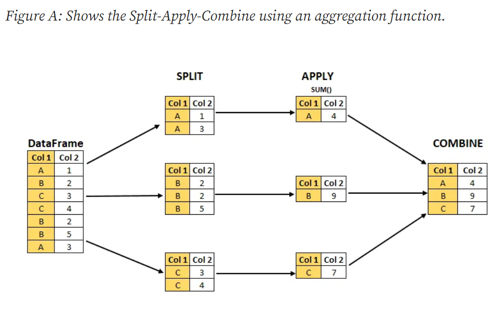

# Split Apply Combine
## Chapter 0: Origin Story

Important Note:
- Code is part of portfolio lesson plan, it does not represent how I code now, and should not be let anywhere near your code base.


### 0.0 - The problem

It was the start of 2020, I was an extremely junior programmer, having stumbled across programming just 16 months earlier, yet with a company-wide reputation for having had memorized the company's entire set of business logic rules, as well as all the columns of most of our database tables.

Having 0 idea what I was doing, I somehow found myself responsible for writing scripts that would pre-aggregate transactional records into analytical tables per the requirements of each department.

Some teams wanted the data grouped by one field, some by multiple, some wanted the aggregated data to omit various sources, some wanted their naming practices to be backwards compatible with their existing tools, and so on.

```php
/**  client-success department */
$cs_country_data = [];
$cs_country_source_data = [];
$cs_source_medium_data = [];

/**  digital marketing department */
$dm_source_medium_data = [];

/** ... etc ... */

foreach($transactional_table as $index=>$row)
{
    $cs_country_data[$row['country']]['clicks']++;
    $cs_country_data[$row['country']]['revenue'] += $row['ppc'];
    
    $cs_country_source_data[$row['country']][$row['source']]['clicks']++;
    $cs_country_source_data[$row['country']][$row['source']]['revenue'] += $row['ppc'];
        
    $cs_source_medium_data[$row['source']][$row['medium']]['clicks']++;
    $cs_source_medium_data[$row['source']][$row['medium']]['revenue'] += $row['ppc'];

    if(in_array($row['source'], $DIGITAL_MARKETING_SOURCES)){
        $dm_source_medium_data[$row['source']][$row['medium']]['clicks']++;
        $dm_source_medium_data[$row['source']][$row['medium']]['revenue'] += $row['ppc'];
        $dm_source_medium_data[$row['source']][$row['medium']]['cost'] += $row['cost'];    
    }   
    /** ... and so on ... */    
}
```
I won't even mention the mess that I had to write to unpack / unroll these deeply nested objects to perform operations on leaf nodes.

```php
foreach($nested_objects as $k=>$v){
    foreach($v as $sk=>$sv){
        foreach($sv as $ssk=>$ssv){
            foreach($ssv as $sssk=>$sssv){
                foreach($sssv as $ssssk=>$ssssv){
                    /** do something here */
                }
            }
        }        
    }
}
```
Pyramids of doom everywhere. 

I also kept making mistakes everytime I touched the code as I wasn't able to implement any principles of DRY (not that I knew what that even was back then), and thus would constantly mess things up for existing datasets when adding a new one.

### 0.1 - A cry for help

I think I knew about recursion already by then, but had no idea how to actually implement it. I came up to one of our senior engineers, explained my problem and asked if he could help me figure something out.

I asked him to help me write something that would:

> 'help me dynamically group and ungroup things by as many levels as I needed'

The senior engineer sent me a file later in the evening as well as a link to an article on Medium.

The code (recreated from memory):

```php

$group_by_rules = [
    'cs_country_data'       => ['country'],
    'cs_source_medium_data' => ['country', 'source', 'medium'],
];

$out = [];
foreach($table as $index=>$row) {
    foreach($group_by_rules as $rule=>$group_by_keys){
        
        /** Build Key */
        $key = "";
        foreach($group_by_keys as $group_by_key){
            $key .= $row[$group_by_key];
        }
        /** Aggregation Function */        
        $out[$rule][$key]++;    
    }
}
```
and [The article](https://medium.com/analytics-vidhya/split-apply-combine-strategy-for-data-mining-4fd6e2a0cc99)



EUREKA! 

How could I have been so blind?! I don't need to recursively try to nest anything, I can just create a key from concatenated values, and group just by that key!

The engineer did just enough to solve my problem, but left the implementation up to me. A symphony of ideas was swirling through my mind.

### 0.2 - Implementation

First thing first, I expanded the ++ logic (count) into all the aggregation functions I needed. 


```php
if ($aggregate['aggFunction'] == "sum") {

    $grouped[$key][$aggregate['alias']] += $appendValue;

} elseif ($aggregate['aggFunction'] == "count") {

    $grouped[$key][$aggregate['alias']] += 1;
... and so on ...
```

Next, I needed to solve the issue that some aggregations were conditional based on the type of row that was being analyzed 

```php
foreach($transactional_table as $index=>$row)
{
    /** This problem, how to pass in conditionals ???  */
    if(in_array($row['source'], $DIGITAL_MARKETING_SOURCES)){
        $dm_source_medium_data[$row['source']][$row['medium']]['clicks']++;
        $dm_source_medium_data[$row['source']][$row['medium']]['revenue'] += $row['ppc'];
        $dm_source_medium_data[$row['source']][$row['medium']]['cost'] += $row['cost'];    
    }
```

I think it will be the easiest just to show you the configuration array that you needed to pass in to make my SplitApplyCombine function work

```php
$instructions = [
    ['count', 'id', 'total_views', [['event_name', '=', 'view']]],
    ['sum', 'ppc', 'total_revenue', [['event_name', '=', 'view']]],    
    ['count', 'id', 'organic_views', [['event_name', '=', 'view'], ['ppc', '=', 0]]],
];
```

Each instruction consisted of 4 parts:
1. aggregation function (count/sum/etc)
2. the column to pass into the aggregation function 
3. the alias (what would the output metric be called?)
4. an array of conditionals that had to be met, for the aggregation function to be applied (aka for the row to count)


And just like that, my scripts began to take shape. The amount of code I was writing started dropping immediately, bugs started to became less frequent, and things seemed to be going full steam ahead.


### 0.3 Usage

Let's imagine a SQL query like this:

```sql
SELECT
    country, 
    region,
    COUNT(id) AS total_events,
    SUM(CASE WHEN event = 'click' THEN revenue ELSE 0 END) AS click_revenue,
    SUM(CASE WHEN event = 'apply' THEN revenue ELSE 0 END) AS apply_revenue
FROM
    data_source
GROUP BY
    country, region
```
Would be written in my early DSL as:
```php

$sac = new SplitApplyCombine();
$out = $sac->execute(
    get_transactional_records(),
    ['country', 'region'],
    [
        ['count', 'id', 'total_events', []],
        ['sum', 'revenue', 'click_revenue', [['_event', '=', 'click']]],
        ['sum', 'revenue', 'apply_revenue', [['_event', '=', 'apply']]],
    ]
);
```

It is impossible to get back the original source code of the very first SplitApplyCombine, but the rough source code is provided to you in the src directory.

Things were working, I was happy, and as far I could tell, nothing could go wrong ...

[...continue to Chapter-1: The Big Uh-Oh](https://github.com/miarez/SplitApplyCombine/tree/main/Chapter-1-The-Big-Uh-Oh)

