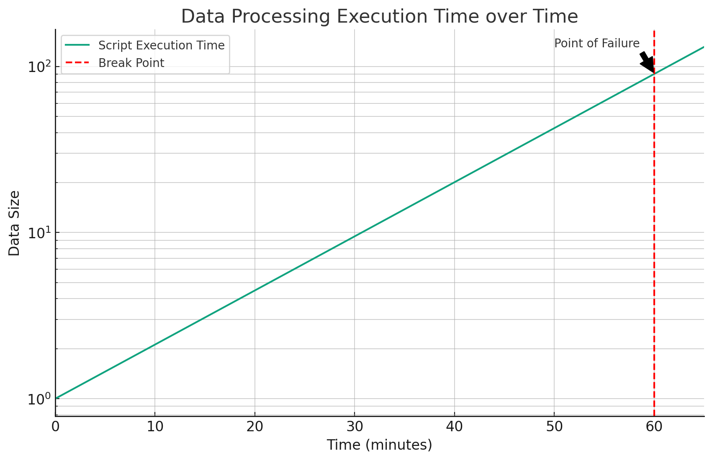
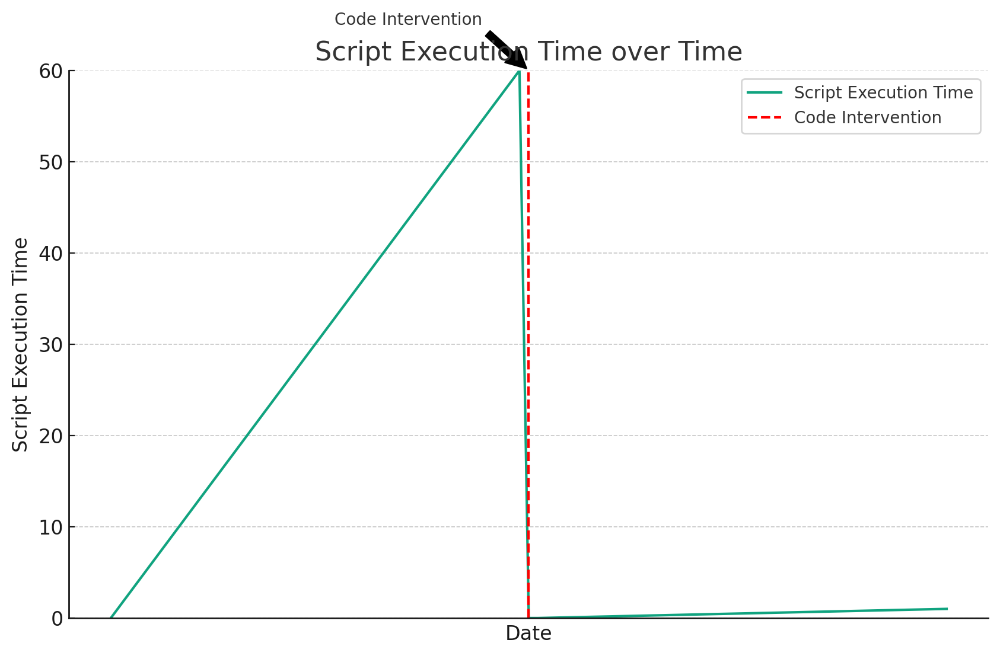
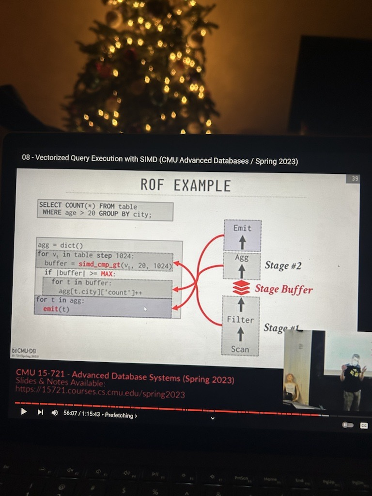

# Split Apply Combine
## Chapter 1: The Big 'Uh-Oh'

### Note:
- This README is part of portfolio piece detailing the origin story of a project
- This is a continuing of [The Previous Chapter](https://github.com/miarez/SplitApplyCombine/tree/main/Chapter-0-Origin-Story)
- The code is messy, newbie, and should not be used


### 1.0 - Smooth Sailing

The SplitApplyCombine class sat firmly in production, trucking away, aggregating tens of millions of rows of data a day for a rapidly growing startup.

The culture in the company was hacky and scrapy. Get things done, make things work. Pragmatism to its absolute maximum extent.

We also had many, many other things to do, so under a `if it ain't broke don't fix it` mentality, no real additional work went into SplitApplyCombine.

I had a junior developer on my team by this point, despite being brutally junior myself, but hey, startup vibes, things move fast.The junior took a liking to SplitApplyCombine, which gave me some reassurance that I created something worth keeping around. It aided in Developer Experience, and so it stuck.


### 1.1 - Some small hiccups

Since as a company we were 'faking it till making it', requests for additional data transformations came in frequently. One of the most memorable was adding a DISTINCT COUNT functionality. 

The issue with distinct became a recurring theme in data aggregation, even meriting its own internal name, 'the distinct problem'. We realized that once you aggregate data, you 'collapse' it, meaning you lose ability to know finer details about the initial data before collapsing. 

For SplitApplyCombine, the issue presented itself as the following.

Remember that when we rip through our array, we simply append the values in the the response object.

```php
if ($aggregate['aggFunction'] == "sum") {
    $grouped[$key][$aggregate['alias']] += $appendValue;
} elseif ($aggregate['aggFunction'] == "count") {
    $grouped[$key][$aggregate['alias']] += 1;
```
For distinct however, I realized I would need to take a different approach and hold all the values until the very end, and then determine how many unique entries were present within each aggregation key.

To make this possible I had to add another property to the class called
```php
$this>-distinct = [];
```
And modify my aggregation function section to include it
```php
} elseif ($aggregate['aggFunction'] == "distinct") {
    $this->distinct[$key][$aggregate['alias']][$row[$aggregate['groupByKey']]] = 1;
```
Which then of course required a post-processing step once all the rows were looped over 
```php
# this little section is here to make "distinct count" possible!
if ($this->distinct) {
    foreach ($grouped as $key => $value) {
        if ($this->distinct[$key]) {
            foreach ($this->distinct[$key] as $type => $uniqueArray) {
                $grouped[$key][$type] = sizeof($uniqueArray);
            }
        }
    }
}
```
While this was an easy fix, and likely took a couple of hours to add to the codebase, it was haphazardly showed into the functionality without any sort of refactoring or restructuring.

This, along with many other little hacks, were added to SplitApplyCombine, as well as helper functions which lived outside the initial class. This caused the codebase to start growing again, as pieces were hacked together for different teams and departments, and little time or consideration was allocated to recompiling things into a clean and centralized structure. 

The company was making money hand over first, there were plenty of things to do, so we kept pushing forward.

That is, until I began notcing a very big problem.

### 1.2 The Big Uh Oh

The developers were killing it, the sales reps were killing it, everyone was making the company grow ... which also meant the amount of transactional records started to grow. 

My algorithm wasn't amazingly fast, but it did the job relatively well, that is until a certain data size was reached. All of a sudden, it was taking 10 minutes to run the script, the 20, then 30. 

The approach was headed towards disaster. Ingestion scripts ran every hour, and were soon going to take over an hour to run. I was screwed. 



Our senior engineer at the time (and still now) was also a hacky, pragmatic self-taught programmer, albeit one orders of magnitudes smarter and more experienced than myself. 

The Senior engineer in question? [Daniel Acevedo](https://github.com/ACV2) 

He took one look at the script and identified the issue. 
```php
/**
 * Grouped Array Looks Like:
 * [key1] = [data]
 * [key2] = [data] ...
 * if [key3] does not yet exist, create it & append it to grouped array
 * It will exist the next loop, and go into the else statement instead
 */
if (!array_key_exists($key, $grouped)) {
```

He pointed out how as the array of the grouped results grew, each loop over my transactional record would be looking through a larger and larger dictionary of values. 

He took a stab in the dark and proposed for me to:
- 1 order the list by our customer name ascending 
- 2 'pop off' from the grouped array as soon as the script finished looping over each client name

I hacked the solution into my production in the following way:

```php
# iterate over transactional data
foreach ($data as $k => $row) {

    if ($popOffStack) {
        # if the current client-name does not match the initial client-name...
        if ($row[$popOffStackBy] != $currentSelector) {
            # add the data to a separate array where the client-name is key
            $stack = array_merge($stack, $grouped);
            # clear my grouped array
            unset($grouped);
            $grouped = [];
            # reset my "current" client-name
            $currentSelector = $row[$popOffStackBy];
        }
    }
```

As always, the head engineers knew that I was a deeply curious learner, and only gave me a general guideline, letting me tinker to find the actual implementation myself. The messy source code is my own doing, as a heads up.

If things ever truly hit a dead-end, they would surely step in and professionally rewrite what I messed up. But while I was learning and getting things done in a timely manner, they left me to solve my own issues.



And just like that, SplitApplyCombine got a breath of second life. 

### 1.3 - In Retrospect

This was my first ever introduction to algorithms. It was the first time I ever witnessed a change in logic making such a radical impact on performance.

This fueled a deep desire to learn more, and to seek harder problems. 

Years down the line, while researching extremely advanced modern day database principles I stumbled across this slide in Graduate level database systems course



Modern day vectorized execution engines use something with a very fancy name called 'Relaxed Operator Fusion', which I noticed eerily resembled the senior engineer's hacky solution.

I texted Daniel and asked if he had known about "Relaxed Operator Fusion" at the time, to which he replied that he simply just made up some shit that seemed to be the way to solve the problem.


### 1.4 - Parting Thoughts

By this point, SplitApplyCombine was a hit for the data team, but I saw developers from other teams still struggling with dynamic aggregations and nested loops. 

I tried to sell people on my helper class, but people considered it to be too hacky and unintuitive to use. 

I wanted to fix this.

[...continue to Chapter-2: Trying To Sell Others](https://github.com/miarez/SplitApplyCombine/tree/main/Chapter-2-Trying-To-Sell-Others)
