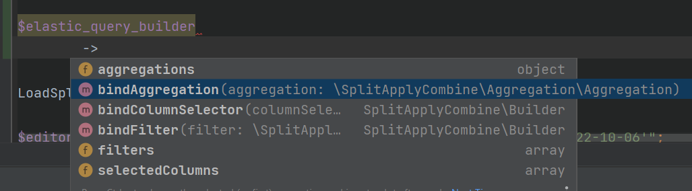
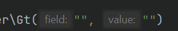
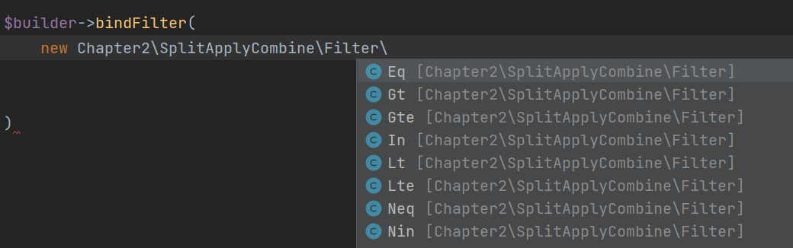
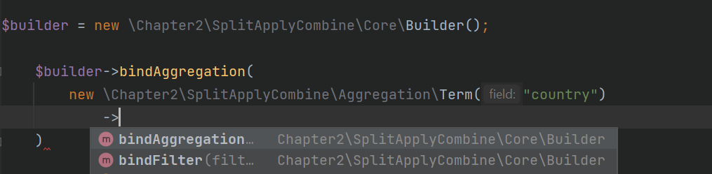

# Split Apply Combine
## Chapter 2: Trying To Sell Others

### Note:
- This README is part of portfolio piece detailing the origin story of a project
- This is a continuing of [The Previous Chapter](https://github.com/miarez/SplitApplyCombine/tree/main/Chapter-1-The-Big-Uh-Oh)
- The code is messy, newbie, and should not be used

### 2.0.0 - A better intermediary representation

At this point in time, SplitApplyCombine was still extremely unintuitive to use as besides a tiny bit of documentation, it wasn't very clear what needed to be passed into the class to make it work. 

It was very difficult to determine the format of the input arrays:
```php
$out = $sac->execute(
    get_data(),
    ['client_code', 'country', 'region'],
    [
        ['count', 'id', 'total_events', []],
        ['sum', 'revenue', 'click_revenue', [['_event', '=', 'click']]],
        ['sum', 'revenue', 'apply_revenue', [['_event', '=', 'apply']]],
    ]
    , true
    , "client_code"
);
```

I just came off writing a PHP Decorator Library for ElasticSearch as we encountered a similar issue on the BI Team when working with complex ElasticSearch queries.

The wrapper honestly didn't do anything besides give us Type Safety, but most importantly AutoCompletion in our IDE.


#TODO Change for elastic query builder screenie!

I knew that if SplitApplyCombine was to get any traction, I needed to add an intermediate representation version to help others understand how to use it.

I started by identifying the basic blocks of functionality in the query builder

```php
class Builder {
    # SELECT
    public function bindColumnSelector() : self
    # WHERE
    public function bindFilter(Filter $filter) : self
    # GROUP BY
    public function bindAggregation(Aggregation $aggregation) : self
}
```
#### 2.0.1 - Filters / Predicates / Conditionals / Where Clause
I decided to focus next on the Filter section (the conditionals/predicates).

We had a company-wide ban on using inheritance, meaning we had to fit all functionality that pertained to an entire product within 1 class. This meant we had 20,000 - 50,000 monolith classes. 
I decided that I wasn't going to ask for permission, rather for forgiveness, and went full steam ahead of breaking things out into a lot of classes. 

I knew about the issues of 'class explosion' and roughly knew that over-use of inheritance leads to severe issues in the code down the line. But I was young and dumb, and wanted to see what the warnings were all about.

For filters the code structure looked like this:

```php
# All Filters Had a Parent Class
abstract class Filter {}

# All Filters that compared a single value has a TERM parent
abstract class Term extends Filter {
    public function __construct(
        string $field,
        string $value
    ) {}
}

# While "IN" and "NOT IN" inherited from TERMS (that required an array as its value)
abstract class Terms extends Filter {
    public function __construct(
        string $field,
        array $values
    ) {}
}


```

Having type hinting on the input parameters helped make it easy to know what you were supposed to pass in:


For the sake of type safety, as well as to be able to dynamically dispatch functionality without the need for case-when statements over strings, I chose to represent every type of filter using its own class. Leaving me with the following classes:

```php
class Eq    {} # =
class Neq   {} # <>
class Gt    {} # >
class Gte   {} # >=
class Lt    {} # <
class Lte   {} # <=
class In    {} # IN
class Nin   {} # NOT IN
```

AutoComplete made using the builder a lot more intuitive




Each Filter class also came with the logic for how the interpreter would execute the filter:

```php
class Eq extends Term {
    public function validate(
        $value
    ) : bool
    {
        if($value != $this->value){
            return false;
        }
        return true;
    }
}
```

This also greatly simplified the code of the interpreter

```php
private function validateFilters(
    array $filters,
    array $row
) : bool
{
    foreach($filters as $filter)
    {
        if($filter->validate((string) $row[$filter->field]) === FALSE){
            return FALSE;
        }
    }
    return TRUE;
}
```

#### 2.0.2 - Aggregations / Group Bys

Group bys seemed like the easier thing to implement, so they became my next focus of attention.

From writing the ElasticSearch Decorator, I learned that ElasticSearch treats Aggregations and Aggregation Functions similarly/ somewhat interchangeably .

The basic structure I settled upon is:

```php
# All Aggregations are children of an aggregation
abstract class Aggregation {}

# All GROUP BYs are Bucket Aggregations 
class BucketAggregation extends Aggregation {}

# All Aggregation Functions are Metric Aggregations (SUM, COUNT, etc.)
class MetricAggregation extends Aggregation {}
```

As always, I made classes for each type of bucket aggregation that the interpreter would support

```php
abstract class BucketAggregation extends Aggregation {};
# group by just 1 term (i.e. country)
class Term extends BucketAggregation {}

# group by multiple terms (i.e. country, source)
class Terms extends BucketAggregation {}
```
On the side of the interpreter nothing changed, group bys were still achieved through creating a concatenated key out of the values for each group by field in the row.

```php
# create key out of the current row value with glue
$key .= $currRow.$this->keyDeliminator;
```


#### 2.0.2 - Select & Aggregation Functions (* COUNT, SUM, etc.)

As above, this was achieved simply through creating classes for the kind of aggregations that were available to you

```php
class Count extends MetricAggregation {}
class Distinct extends MetricAggregation {}
class Sum extends MetricAggregation {}
class Avg extends MetricAggregation {}
class Last extends MetricAggregation {}
class First extends MetricAggregation {}
```

#### 2.0.3 - Some Fanciness 

Now, in elasticsearch the big differentiator between Metric and Bucket Aggregations is that Bucket Aggregations can have children, metric Aggregations cannot. 

Meaning you can put a MetricAggregation inside a Bucket Aggregation. In Elasticsearch you can put Bucket Aggs in Bucket aggs, but I ran out of steam to make this happen for split apply combine.



You can also put an embedded filter within a bucket aggregation, meaning any aggregation functions you apply within the bucket will pass a secondary filter set.

All In all, this means you can get multiple levels of results back from the same query, unlike in SQL that always returns either a Scalar or a Table.

A cool product was launched in the company around that time that heavily relied on reference pointers in PHP, and I was very eager to try using them myself to see what the hype is all about. 

I really wanted to keep the code DRY, and thus needed some form of recursion to allow myself to execute filters & metric aggregations that were inside of bucket aggregations using the same block of code regardless of their nest level.

```php
$this->aggregationPointer = &$this->query->aggregations;
$this->processAggregations($row);
```

At the main execution method of the interpreter I made a reference pointer to the first level of aggregations and bound it to a class-scoped variable.

Then, if the first type of aggregation I saw within the processAggregations methods was a metric aggregation, I would simply process it
```php
if($aggregation instanceof MetricAggregation)
{
    $this->dataPointer = &$this->result[$aggregation->alias];
    $this->processMetricAggregation($aggregation, $row);
    continue;
}
```
Versus if sub-queries of filters were present before metric aggregations, I would re-reference the pointer to the subAggregation and run the metric aggregation via the same method as above

```php
$this->dataPointer = &$this->result[$aggregation->alias][$key][$subAggregation->alias];
$this->processMetricAggregation($subAggregation, $row, $aggregation->alias, $key);
```

I had everything geared up for recursively nested aggregations, however threw up this error, then ran out of steam, and never fully implemented the functionality.

```php
if($subAggregation instanceof BucketAggregation) {
    Throw new \TypeError("Nested Bucket Aggregations Not Supported In This Version");
}
```

I did feel fancy enough to add functionality to add 'scripting' as in ElasticSearch to metric aggregations 

```php
(new Sum("ppc", "country_total_revenue"))
    ->expression(
        new Divide(100)
    )
```

Allowing myself to apply arithmetic functions on Metric Aggregations on the fly which I decided to call expressions

```php
abstract class Expression {}
class Add extends Expression {}
class Subtract extends Expression {}
class Divide extends Expression {}
class Multiply extends Expression {}
```

I had a plan to expand this further to allow for `round` , `floor`, `ceiling`, etc.

#### 2.0.4 - A completed intermediary representation DSL library!

```php
$builder = (new Builder())
    ->bindColumnSelector(
        [
            new Count("_id", "total_events"),
            new Sum("ppc", "total_revenue"),
        ]
    )
    ->bindFilter(
        new Eq("status", "premium_client")
    )
    ->bindAggregation(
        (new Term("country"))
            ->bindFilter(
                new In("source", ["email", "organic"])
            )
            ->bindAggregation(
                (new Sum("ppc", "country_total_revenue"))
                    ->expression(
                        new Divide(100)
                    )
            )
    )
;
```

### 2.1.0 - SQL Support

Believe it or not, I wasn't happy nor finished yet. 

As you may find from reading my entries, I have a deep fascination with SQL, particularly SQL Syntax. I decided that I needed to add support for SQL like queries.

I found a PHP SQL Parser that was relatively easy to understand and rewrote it line-by-line, leaving only what I thought was necessary for my own needs (as well as simplifying the folder structure for my smoothed brain self).

I cover in greater detail what I learned from re-writing the SQL Parser in another blog entry, where I discuss [naively writing my own programming language](http://localhost/AlgorithmResearchLabs/github/protolang)

I saw the problem as being composed of 3 steps:

```php
# Build Tokens From the SQL query string
$tokens     = (new Chapter2\Parser\Tokenizer())->run($query);

# re-group the tokens back into instructions for what they're supposed to do
$lexTree    = (new Chapter2\Parser\BeyondSQLSACLexer())->lex($tokens);

# Build the Intermediary Language Object from the Lexer Instructions
$sacQuery   = (new Chapter2\Parser\BeyondSQLToSACInterpreter())->interpret($lexTree);
```

I have to admit this was the very first time ever that I used & actually benefited from proper code structure & design patterns. 

I didn't overthink whether everything would work, I just built each piece to do what it was supposed to do (Single Responsibility Principle) and hoped the lego pieces would all click together. 


#### 2.1.1 - Tokenizer

I will not go into great detail regarding the tokenizer works in this post, as it is relatively well documented in the blog post mentioned above.

In a nutshell, the first step is to loop over the query character by character

```php
$queryCharPosition = 0;

# Loop over every single character in the query
while ($queryCharPosition < strlen($dslQuery)) {
```
And concatenate all the characters into a variable
```php
$token .= $dslQuery[$queryCharPosition];
```
Special characters are specified within the class
```php
private const SPLITTERS = ["\r\n", "!=", ">=", "<=", "<>", ":=", "\\", "&&", ">", "<", "|", "=", "^", "(",    ")", "\t", "\n", "'", "\"", "`", ",", "@", " ", "+", "-", "*", "/", ";", "[", "]"];
```
That when found...
```php
# if the selection is an actually valid splitter
if (in_array($selection, self::SPLITTERS)) {
```
... 'split' the string into the token value it collected, and the rest of the string
```php
# append the current selection to the tokens
$tokens[] = $selection;
```
Meaning from something like 
```SQL
SELECT *
```
The whitespace is the special token, so anything before the whitespace (SELECT) is split out into a token, and appended to an ever-growing tokens list

So A query of
```sql
SELECT region, sum(ppc) as revenue
FROM my_table
WHERE region <> 'North'
```
Will be in this representation after the Tokenizer
```php
Array
(
    [0] => SELECT
    [1] => region
    [2] => ,
    [3] => sum
    [4] => (
    [5] => ppc
    [6] => )
    [7] => as
    [8] => revenue
    [9] => FROM
    [10] => my_table
    [11] => WHERE
    [12] => region
    [13] => <>
    [14] => '
    [15] => North
    [16] => '
)
```
As you can see from tokens 14-16, strings are broken into separate tokens which needs to get fixed.

We apply another series of methods to fix some issues stemming from character-by-character tokenization

```php
$tokens = $this->extractNestedStrings($tokens);
$tokens = $this->extractNestedExpressions($tokens);
$tokens = $this->extractNestedParentheses($tokens);
```
These methods work in a similar fashion to the original splitter method, however, looping over an array of tokens token-by-token (instead of character by character).

In a nutshell, when something like a backtack (`) is found 
```php
# if a backtick is detected, we know that we need to pursue it until the pairing backtick that closes it
if ($this->isBacktick($token)) {
    $tokens = $this->bindTillClosureToken($tokens, $tokenIndex, $token);
}
```
A method is called that loop over the next tokens appending the value of the next tokens into the current token
```php
# since we are still here, append whatever the current token is to the initial token
$tokens[$startingTokenIndex] .= $token;
```
until another back-tick in found, at which point it returns the newly concatenated initial token
```php
# if the token we just appended also happens to be the closure token, break the loop and get out of the function
if ($token === $closureToken) {
    break;
}
```
After these methods are applied, our tokens look like they're ready for the lexer!
```php
Array
(
    [0] => SELECT
    [1] => region
    [2] => ,
    [3] => sum
    [4] => (ppc)
    [5] => as
    [6] => revenue
    [7] => FROM
    [8] => my_table
    [9] => WHERE
    [10] => region
    [11] => <>
    [12] => 'North'
)
```

#### 2.1.2 - Tokenizer

The lexer works in a similar manner once again, looping over tokens and applying some logic based on what sort of token it is currently on, and what sort of token it is looking at now.

First thing first, is we want to figure out the category of each token. The easiest way to explain this is that some tokens indicate that a new category (clause) is starting, whereas some tokens do not change the clause.

Tokens that start new CLAUSES
```php
/* Tokens that get their own sections. These keywords have subclauses. */
case 'METRIC':
case 'SELECT':
case 'ORDER':
case 'LIMIT':
case 'GROUP':
case 'WHERE':
    $currentTokenCategory = $upper;
    break;
```
Tokens that do not start their own clauses
```php
    break;
case 'BY':
    continue 2;
    break;
case 'AS':
    break;
case '':
case ',':
case ';':
    break;
default:
    break;
```
If you think about it, it makes sense. AS in an alias within a SELECT clause, not a special keywork like GROUP or WHERE.

At this point, our tokens are now nested within the kind of category they are in

```php
Array
(
    [SELECT] => Array
        (
            [0] => region
            [1] => ,
            [2] => sum
            [3] => (ppc)
            [4] => as
            [5] => revenue
            [6] => FROM
            [7] => my_table
        )

    [WHERE] => Array
        (
            [0] => region
            [1] => <>
            [2] => 'North'
        )

)
```
We now take each category, and loop over it token by token, assembling the general SQL query logic.
```php
self::extractSelectClause($tokensByClause["SELECT"]);
self::extractSelectClause($tokensByClause["WHERE"]);
self::extractSelectClause($tokensByClause["GROUP"]);
```
For the where clause, we further split the array by the AND token
```php
$hold = self::splitArrayByDelimiter($whereTokens, "AND");
```
Giving us once again a split list of tokens
```php
Array
(
    [0] => Array
        (
            [0] => region
            [1] => <>
            [2] => 'North'
        )

    [1] => Array
        (
            [0] => country
            [1] => =
            [2] => 'us'
        )

)
```
We apply some logic to wrestle in the LEFT | OPERATOR | RIGHT nature of a conditional into the shape we need 
```php
$tokens[] = [
    "COL_REF"   => $whereClause[0],
    "OPERATOR"  => self::FILTER_BASE.self::OPERATOR_MAPPING[strtoupper($whereClause[1])],
    "CONSTANT"  => $whereClause[2],
];
```

As you will notice, we don't just map the token values to the array, we map the actual SplitApplyCombine classes to the token array!
```php
private CONST FILTER_BASE               = "SplitApplyCombine\Filter\\";
private CONST AGGREGATION_FUNCTION_BASE = "SplitApplyCombine\Aggregation\\";

private CONST OPERATOR_MAPPING = [
        '='         => "Eq",
        '>'         => "Gt",
        '>='        => "Gte",
        'IN'        => "In",
        '<'         => "Lt",
        '<='        => "Lte",
        '<>'        => "Neq",
        'NOT IN'    => "Nin",
    ];
```

Apply similar (but slightly different) logic for the SELECT / GROUP BY clauses and all of a sudden are tokens are organized in a way we could work with much more easily.

```php
Array
(
    [WHERE] => Array
        (
            [0] => Array
                (
                    [COL_REF] => region
                    [OPERATOR] => SplitApplyCombine\Filter\Neq
                    [CONSTANT] => North
                )

            [1] => Array
                (
                    [COL_REF] => country
                    [OPERATOR] => SplitApplyCombine\Filter\Eq
                    [CONSTANT] => us
                )

        )

    [SELECT] => Array
        (
            [0] => Array
                (
                    [COL_REF] => region
                )

            [1] => Array
                (
                    [AGG_FUNCTION] => SplitApplyCombine\Aggregation\SUM
                    [COL_REF] => ppc
                    [ALIAS] => revenue
                )

        )

)
```

At this point I was getting very nervous if the lego pieces would all fit together...


#### 2.1.3 - Interpreter 

So the whole time my logic was 

>If a human can use the intermediary representation builder to build a query ... a builder can use the builder to build a query

Let me tell you, boy was I relieved when it turned out to work! 

For example
```php
foreach($lexTree["WHERE"] as $where)
{
    $class_name = "\\Chapter2\\{$where['OPERATOR']}";
    $sacQuery->bindFilter(
        (new $class_name($where["COL_REF"], $where["CONSTANT"]))
    );
}
```
Easy right?

It was easy for SELECTS, it was easy for GROUP BYs, and just like that I was done! 

So chaining together these modules
```php
$tokens     = (new Chapter2\Parser\Tokenizer())->run($query);
$lexTree    = (new Chapter2\Parser\BeyondSQLSACLexer())->lex($tokens);
$sacQuery   = (new Chapter2\Parser\BeyondSQLToSACInterpreter())->interpret($lexTree);
pp($sacQuery, 1);

```
Gave the output:

```php
Chapter2\SplitApplyCombine\Core\Builder Object
(
    [aggregations] => stdClass Object
        (
            [revenue] => Chapter2\SplitApplyCombine\Aggregation\Sum Object
                (
                    [alias] => revenue
                    [field] => ppc
                )

        )

    [selectedColumns] => Array
        (
            [0] => region
        )

    [filters] => Array
        (
            [0] => Chapter2\SplitApplyCombine\Filter\Neq Object
                (
                    [field] => region
                    [value] => North
                )

            [1] => Chapter2\SplitApplyCombine\Filter\Eq Object
                (
                    [field] => country
                    [value] => us
                )

        )

)
```

And since the Split Apply Combine interpreter simply needed a query builder object, things were as smooth as butter!

```php
$query = "
SELECT count(id) as total
FROM my_table
WHERE region = 'North'
";

$tokens     = (new Chapter2\Parser\Tokenizer())->run($query);
$lexTree    = (new Chapter2\Parser\BeyondSQLSACLexer())->lex($tokens);
$sacQuery   = (new Chapter2\Parser\BeyondSQLToSACInterpreter())->interpret($lexTree);
$data       = (new Chapter2\SplitApplyCombine\Core\Execute(load_demo_data(), $sacQuery))->calculate();

pp($data, 1);
#output:
Array
(
    [total] => 9
)
```

### Parting Thoughts 

Personally, this was huge for me. 

I learned how tokenizers, parsers, lexers and interpreters worked.

I learned the value of Single Responsibility Principle. 

I learned the value of modularized thinking, breaking a bix project out into smaller sections and having faith that the sections will all click together come time to join them.

[...continue to Chapter-3: Death To Rebirth](https://github.com/miarez/SplitApplyCombine/tree/main/Chapter-3-Death-Rebirth-And-Moving-Out)
